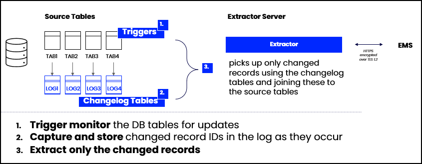
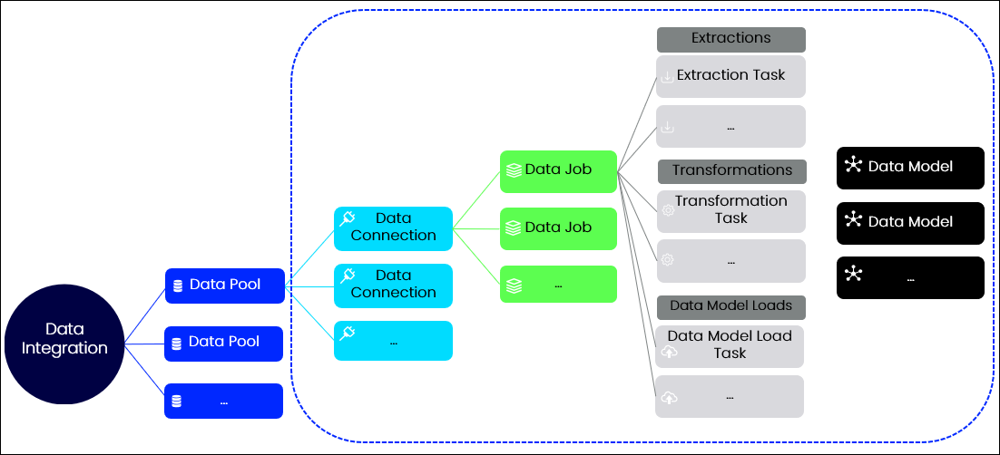

# Get Data Into Celonis
url: https://academy.celonis.com/learn/learning-path/get-data-into-the-ems-1
access: https://fox57xlh-2026-02-04.training.celonis.cloud

## Data Integration Basics
- Process Data is a set of connected activities with timestamps following one specific case = tracking steps 
- Data Model connects
  - one or more activity tables
  - case tables
  - and master data tables

### Data Integration Methods
- **C** connect to source systems
- **E** extract the relevant data
- **T** transform it to your needs
- **L** load 

### Process Connectors = prebuilt data integrations
- Process Connectors contain templates and scripts that support you in the connect, extract, transform, load, and scheduling steps of building your data pipeline

### Real-Time
- frequently replicate **incremental** changes in data from source systems 
- **non-real-time** data pipelines are typically mostly based on **scheduled full loads**
- real-time data integration only for E and T step not for Data Model Load. L relies always on a scheduled jobs

### Advantages of real-time
- Extract
  - Faster performance
  - Smaller burden on source systems as changes are tracked and extracted using native capabilities of source systems.
  - Close to no need for full extractions except at the very start of your integration.
- Transform
  - Faster performance of transformations
  - Highly reduced need for full table transformations

### Data Model
- Data Model connects
  - one or more activity tables
  - case tables
  - and master data tables

- Operational Data Model
  - Celonis recommends creating smaller, operational Data Models
  - **restricted data scope** examining only the most recent, prevalent cases
  - Model is smaller, loads faster and is the one business users use in day-to-day business

- Analytical Data Model
  - analysts can drill down into processes, look for patterns, filter and so on. 
  - do not necessarily require real-time data.
  - regular complete loads of the data

## Connect to Systems
### Main Connection Methods
- Process Connectors (from the market place) **most common method**
- Extractors (Data Connections)
- Extractor Builder
- File Uploads
- Data Ingestion API
- Celoxtractor

### Extractors 
- blank data connections with no reference to a process
- connect to source systems and then have to build your data pipeline from scratch
- for on-prem you need an uplink client (on-prem connector)
- Only **read-only** operations on data
- Categories:
  - On Prem
  - Cloud
  - Custom 
  
### Extractor Builder
- find it under "Create custom REST API extractor" when connecting new data sources
- specific to your data pool, but you can export it. But connection details are not included in the export
- Setup an extractor with the extractor builder
  1. Variable: e.g. API URL
  2. Authentication: e.g. OAuth2, Baisc AUth
  3. Data Connection
  4. Add Endpoint: e.g. /users
     -  req params
     -  header
     -  pagination
     -  response configuration
     -  response rules: e.g. skip 500 status
  
 More to come in this course: https://academy.celonis.com/learn/course/extractor-builder-basics-q6vs/extractor-builder-basics/basics?client=partner

### File Upload
- 1GB max size
- multiple files can be uploaded at once in one table, but they need to have the same structure

### Data Ingestion API
- push data into Celonis from Kafka or other tools
- need basic programming skills to use it

- Data Ingestion API Spec
  - One API call per table: Every table you create or update requires one API call.
  - Built on S3 API: It's built on top of the S3 API with the same methods and error codes. It uses primarily this S3 PUT object endpoint.
  - Continuous load: The load is continuous. So as soon as you ping the API, your data is loaded into Celonis. It operates on a First In First Out (FIFO) principle.
  - Auto-delta load: All pushed records are loaded as delta records automatically and compared to existing records. 
  - Nested data possible: The API can handle nested (json) data out-of-the-box and unnest it into tables and columns.
  - UI schema configuration: It supports a UI based configuration for table schema, i.e. table names, keys, age columns.
  - Parquet files only: As of today, the API only supports parquet files and requires you to convert to parquet before pushes.

### Celoxtractor
- The Celoxtractor is a Python package designed to let you develop your own Celonis Extractor easily.
  - complete control over your data,
  - feature parity to native Celonis extractors,
  - and full flexibility in adjusting all aspects of your extractions.

#### Connection and Extraction
- Closed Hosting Environments
  1. Extractor establishes connection to Data Integration.
  2. Data Engineer defines which tables to extract in Data Integration.
  3. Extractor informs source system of what data to extract.
  4. Data extraction is performed.
  5. The extracted data is sent to the Extractor Server.
  6. The Extractor Server transforms the files into parquet files.
  7. The Extractor Server sends the transformed to the Celonis data Storage.

- Open Hosting Environments
  1. Extractor establishes connection to the Cloud system and requests data.
  2. Data Engineer defines which tables to extract in Data Integration.
  3. Cloud system extracts data and sends it to the Cloud Extractor.
  4. Cloud Extractor transforms the files into parquet files.
  5. Cloud Extractor sends the transformed files to the Celonis Data Storage.

### Real-Time Connections/Extarctions 
  1. Create Change Log tables to store changes
  2. Install Triggers to monitor and capture changes
  3. Activate a cleanup background job to clean up the Log tables (SAP-specific)

### Data Pools Introduction
https://academy.celonis.com/learn/course/connect/structure-your-data-pools/structure-data-to-your-needs?client=partner&page=2
####  Analogy
- Data Pool = Database
  - Data Connection = Schema
    - Data Job = Stored Procedure
      - Extraction
      - Transformation
      - Load Data Model
- Data Model = Star Schema  

- DATA POOLS	Host one or more Data Connections
- DATA CONNECTIONS	Contain one or more Data Jobs
- DATA JOBS	Contain "tasks" for extraction, transformation, and Data Model load
- DATA MODELS	Pull data from all connections in one Data Pool

#### Best practices for Data Pools
- keep all **related** processes and systems within one Data Pool
- In some cases, it also makes sense to create separate Data Pools for different regional or legal entities to restrict access to the data for certain users or user groups.

## Extract Data
### Extractions can be done by
- Data Jobs
- or Replication Cockpit

Questions to ask on picking the tool
- Is the Process Connector / Extractor real-time?
- Is the data needed for operational use cases (day-to-day actions)?
  
### Data Jobs
- schedule-based 
- full and delta extractions
- used for analytical Data Model
- if there is no rush to always have the freshest data, then data jobs are sufficient.
- extractions make use of filters (not change logs)

### Task Parameters
- private/public
  - A private parameter is only visible and editable for admins of the data pool, whereas a public parameter is visible to everyone who can access the task. Both are static, which means that their value doesn’t change until you enter a new one.
- Dynamic
  - generated from existing data and only visible for admins
- Data Pool parameters: As opposed to Task Parameters, you can use Data Pool parameters across an entire Data Pool.

### Table types in SAP
### Data Jobs
- core tables: essential information
- change tables
- name mapping tables

### Replication Cockpit
- real-time based
- full and delta extractions
- used for operational use cases
- extractions with Replication Cockpit make use of change logs

### Delta Extraction
- new, and updated table rows.
- difference between Full Loads and Delta Loads is that the two filters: "Delta Filter" and the "Enable change date Time filter" are considered.

#### Using Change Date
- table contains a “Change Date" column.
- Celonis automatically identifies duplicates based on the primary key and inserts the new rows, overwriting the old existing rows 
- Alternative: using a dynamic parameter and adding it to the Delta Filter:

#### Using Consecutive Numbers
- using a dynamic parameter FIND_MAX of CHANGENR

#### Using the Creation Date
- if no Change Date available use Creation Date + offset
- so most of the changes will be extracted

### Metadata changes
- To avoid delta load failures after metadata changes, you can activate the “include metadata changes” (added or removed columns in source system tables)
- if the extraction does not include all columns of a table, metadata additions will not be extracted even if the option is selected.
- When should you activate this option?
  - NULL values: Activating the option to include metadata changes may result in NULL values in your data. Let's imagine adding a new column to the table EKPO. This column provides information for each purchase order item, specifically if the item will be used internally or for an end product. However, this information will only be filled after the new column is added and will not be backfilled for past purchases. This may result in an inconsistency in the source system and will be reflected in the extracted data within Celonis.
  - Data type changes not handled: Also, note that if a metadata change is to the data type, the functionality will not handle the updates. For example, if a column’s data type changes from integers to a string the table will not correctly load. In this instance, a full load is required to remove the conflict.
  - Delta Loads are faster: If you are extracting tables that are continuously growing and extending, enabling this functionality will keep your delta loads running. In the end, Delta loads decrease your load time and are faster than full loads

### Performance Optimization
- Deselect irrelevant columns
- Apply filters to extract only the data you need
- Adjust the "Maximum number of parallel extractions"

## Extractions with Replication Cockpit
- Benefits
  - Real-time connectivity: Extractions are orchestrated automatically without user-defined schedules.
  - Automatic self-recovery: Extractions will correct and re-execute in case of temporary failures.
  - Speed & stability: Extractions run faster and are less error-prone because they are separated from transformations.
- Recommended: Transactional Tables (full and delta loads), not for Metadata Tables
  - Transactional Tables = typically change very frequently.

- Need a connection that supports change logs and triggers in the source system, e.g. SAP ECC or S/4HANA
- If an added table does not have a trigger/change log, you'll see a warning that these objects don't exist in the source system.
- You can use a replication template to easily set it up
- deleted records: you can decide to keep them in a separate table or delete them right away
- you can use data pool parameter (but not create ne local parameters)
- Initilazation join configuration = (Full Extraction) -> only on full load
- You have to Initizalize the table (initial load), but you can skip it if you want by clicking "replicate (all)
- In Scope setting: replication frequency, on error, calender
- you can set up emails whenever a table goes into a degraded state
- RC replication = DJ delta extraction
- RC initialization = DJ full extractions 

## Transform Data
1. building one or more Activity Table(s) with all relevant process activities
2. reworking as necessary your Case Table(s) and other relevant master data tables.

### Activity Tables
- possible additional columns user type, sorting, activity key (parent), 

### Case Table
- EKPO

### Master Data Table
-  more detailed information on vendors.

### Templates
- create by converting transformation into template. 
  - manage centrally, changes effect all
  - you can use parameter in templates

### Performant Transformation Basics
- Avoid SELECT * if possible and select only the columns you need to reduce system load.
- Avoid SELECT DISTINCT if possible as it is a taxing statement. The need for DISTINCT usually means something in your query or source system data is causing duplicates. More information on alternatives in the SQL Best Practices course.
- Move conditions into **Extractions** where possible. E.g. in our simple use case, the EKKO.BSTYP = "F" could have been moved to the EKKO table extraction.
- Move WHERE conditions directly into JOINS. This is what with did with EKKO.BSTYP = 'F'. It could have been applied using a WHERE statement at the end of our scripts but we added it directly in the JOIN:
- Use WHERE EXISTS instead of JOIN where possible. Don't use a JOIN if you only need to filter on another table.

### Tables vs Views in Transformations
- Tables
  - when needs to be accessed in transformations
  - create tmp tables when you join theses tables frequently in transformations
- Views
  - A view is a stored query
  - tables that are **not** used in our other transformation could be view (e.g. P2P_EKPO, P2P_EKKO)
  
### Real-Time Transformations
Steps:
1. Identify the trigger table
2. Define the transformation(s) on this Trigger Table
3. Define dependent tables

- Multiple activity tables are created
- initilazation could run weekly or monthly. Im Gegensatz zu Extraction where it should only run oce

How does it works:
1. Delta Extraction creates a staging table with delta records. 
2. Records are processed from Trasnformations. 
3. The staging table is automatically emptied.

- Delta Extraction use delete and insert instead of drop and create
- Delta Extraction use tables not views
- Initialization scripts should create empty tables. Adding a "LIMIT 0"
- Select all columns specifically
- Move Temp Tables into queries or use triggered Temp Tables

### Script Real-Time Transformations for Activities
https://academy.celonis.com/learn/course/transform/replication-cockpit-set-up-transformations/set-up-delta-real-time-transformations?client=partner&page=6
- Data Model Tables
  1. Identify the Trigger Table
  2. Select the Staging Table in query
  3. Use tables instead of views
  4. Use Delete + Insert approach
  5. Move Temp Tables into queries or use triggered Temp Tables
  6. Select all columns specifically
  7. Define dependencies
- Add Activities   
  1. Identify the Trigger Table
  2. Split the Activity Table into many based on Trigger Tables
  3. Use INSERT + WHERE NOT EXISTS in most cases (adjust based on effect of updates in Trigger Tables on your Activity Table)
  4. Move Temp Tables into queries or use triggered Temp Tables
  5. Define Dependencies

## Data Model

### Link Tables Correctly
- The Fact (N) table is always the table with multiple rows for one row in the (1) table. So in the Activity to Case table relationship, the Activity table is the Fact table (N), and the Case table is the Dimension table(1). In other words there are always multiple activities for one Case ID
- A Fact (N) table can have multiple 1 relationships with other tables, but a 1 table should not have multiple N relationships in your Data Model. Avoiding this is important for working within Analyses and the Process Query Language (PQL) later on.
- The Data Model only works with 1:N or 1:1 relationships. Cyclic relationships or M:N relationships should be avoided as they cause issues in the Data Model load and Analyses.

### How to
1. create Activity Table
2. Create case table and master data tables
3. Crreate relationships between tables in the Data Model (foreign key)
4. explicit assign case table

- Dimension table (1) and the Fact table (N)
- Data Storage + Query Engine = Process Data Engine

### Data Flow
1. Extraction: The first step is an extraction from a source system. As per an extraction configuration, Celonis calls the requested data from a source system directly or from an Extractor server installed in a closed hosting environment. This data lands in a transactional database known as the Celonis Data Storage.
2. Transformation: Next, the data is transformed according to your transformations and all new tables and results are also stored in the Data Storage.
3. Data Model Load: Once you’ve defined your Data Model and load it, Celonis pulls the data from Data Storage, transforms it into several parquet files (here is a good parquet definition), and using metadata information on your Data Model’s schema, stores it into the Query Engine. The Query Engine is an analytical database best suited for Analyses.
4. Downstream Activities in Studio: From here, you can now use this Data Model to create Analyses and other Celonis objects in the Studio.

### Partial Data Model Loads
- setup Data Job and configure the needed tables

### Capacity Recommendations
- Per table, aim to have no more than 800 million rows per table.
- Per individual case, aim to have an average case length of 20 activities or less.
- In the Activity Table, aim to have no more than 1000 distinct activities.

### Troubleshooting
- clearly sorted timestamps for your activities
- accurate case keys
- accurate joins between your tables
- clean and matching data in your activity and case table
- no data job running on your tables while you are loading your data model
- no delta extractions when no primary keys were defined

### Model Permissions
- Usage Permissions: who can use the model for downstream activities in the Studio such as an Analyses.
- Data Permissions: who can see which part of the data in the Data Model. Data Permissions allow you to restrict access to your Data Model for certain users. As an example, you could restrict the access of user A, in a way that the user could only see data for a specific company code when opening an analysis that builds on the respective data model.

## Schedule Data Jobs

### Schedules
- they only apply to entire Data Jobs, not to single tasks
- if a Data Job runs Extractions and Transformations, consider adding the applicable Data Model Load task
  - **Without a Data Model Load, your Data Job will have no effect on your Data Model**
  - if you use the Replication Cockpit for certain transactional tables (both full and delta extractions and transformations), you will still need scheduled Data Jobs for: Data Model Loads, the Delta and Full loads of tables you choose not to include in your Replication setup.
- Trigger-based schedule: Trigger the next schedule after the last finished

### Smart ETL
- before extractions and transformations run sequentially
- Celonis runs your extractions and transformations in Data Jobs in the optimal way
- turned on by default on task level
- you can activate Smart ETL at the schedule level.
- Note that Smart ETL for schedules works with frequency-based schedules but not with trigger-based schedules.

1. Calculates the optimal extraction and transformation order: Before each Data Job execution, Celonis calculates the optimal execution order of table extractions and transformations based on the dependencies in a Data Job. For extractions, it takes into account the allowed parallel extractions on a connection, i.e. how many tables Celonis can extract in parallel from a source system. 
2. Creates a DAG (Directed Acyclic Graph) representing the most efficient execution order to optimize for parallelism.
3. Uses DAG to trigger all extraction and transformation tasks based on the optimal calculated execution order. For example, once a table is extracted, the related transformations start automatically (while independent tables might still be in extraction).

----- 
Build an Object-Centric Data Model

## Object-Centric Process Mining: Foundations
### CCMP  
- tracks one object (case) per process and maps all process events into a sequential event log
- Value:
  - providing insight into processes based on the chosen case perspective.
  - allowing businesses to uncover and fix process inefficiencies.
  - helping businesses to track process performance against specific KPIs.
  - allowing businesses to fully or partially automate actions based on process data.
Limitation:
  - restricted perspective
  - Incomplete information, like Duplicates events or missing events

### OCMP
- case
  - Restricted perspective: A limited, fragmented, and fixed perspective	
  - Incomplete information: Missing information and context based on selected case in event logs
  - High Effort: Higher start and update effort due to SQL-based event logs	
  - System dependence: Low scaling due to source system dependent scripts	
- object
  - Flexible multiple perspectives based on a single standardized model
  - More accuracy thanks to object modeling
  - Lower start and update effort thanks to UI-based modeling
  - Better scaling thanks to standardized and system-agnostic objects

## Connect Multiple Systems
#### parallel scenario: one system per country
- set up n connections, and then one Data Job for each connection.
- you should now have n activity tables and every raw data table n times.
- you can reuse extractions and transformations
- resuse: Use Templates and Parameters
- Merge with Global Data Jobs
  - A Global Data Job can access all the tables in your data pool and isn’t limited to one specific data connection.
  - n+1 datajob: n for each country + 1 Global Data Job for merging
  - create one transformation per table
  - use UNION ALL for merging

#### Sequential Scenario: different source systems with different structures, which run different steps of the process
- separate Data Jobs with different extractions and transformations, since they are different per system.
- merge only activity table into one table. Do not merge raw data tables, since they are different per system.

#### Global Data Jobs
- own schema
- access all data from the different schemas
- can’t create extraction tasks in it,
- use UNION ALL for merging

#### Unrelated Processes from One System
- e.g. Purchase-to-Pay data as well as the Accounts Payable in on esystem. But they are unrelated processes, so they should be kept separate.
- apart from the extraction job, you can keep the rest of your work separate in one Data Pool.

#### Multiple Related Processes
- use multiple Activity and Case Tables in one Data Pool =  Multi event log
- first Activity Table you define is the Default Activity Table. 
- Eventlog can be autommerged in PQL, but they are not merged in the Data Model. So you can keep them separate in the Data Model and merge them in Analyses and PQL when needed.
- cases for Multi-Event Log:
  - To put independent processes into context (filter across processes). 
  - To analyze parallel processes by linking multiple hierarchical Event Logs.
  - To reduce transformation script efforts (no joins) by merging Event Logs.
  - To visualize end-to-end processes by linking multiple Event Logs.

### Working with Data Pools
- you can sharing Data Connection between pools, if enabled
- you can version your datapool 
  - Data Jobs,
  - Process Data Models,
  - Data Parameters,
  - Task Templates,
  - Schedules.
  - NOT Data permissions
  - NOT Data Connection details,
  - NOIT actual data
- you can copy a data pool
- you can copy datat jobs
  - Extractions
  - Transformations
  - Local parameters
  - Templates
  - NOT Data Pool parameters
  - NOT Data Model Load tasks
  - NOT Job alerts
  - NOT The tables and data  
